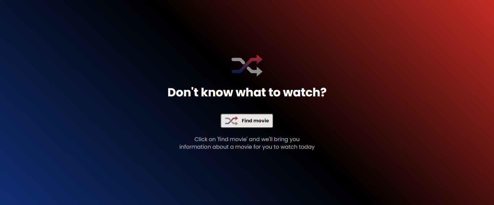
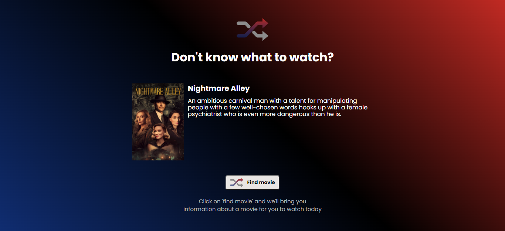
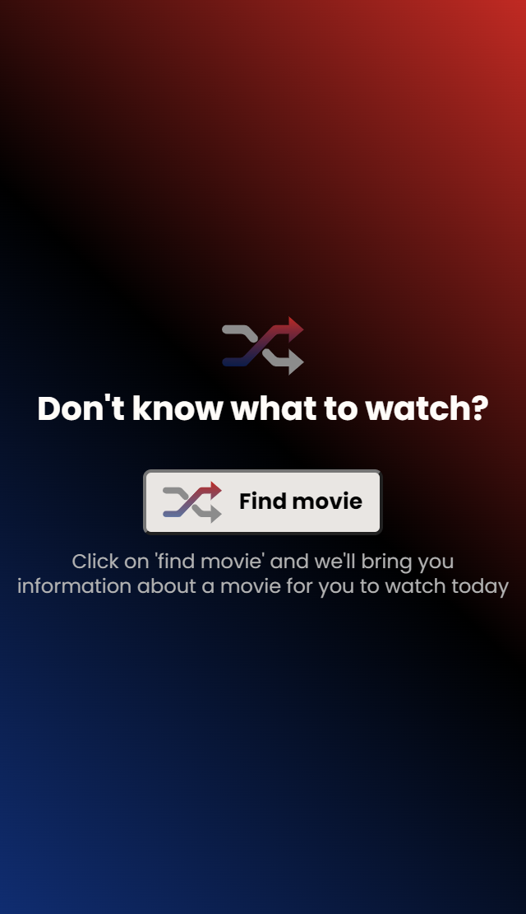
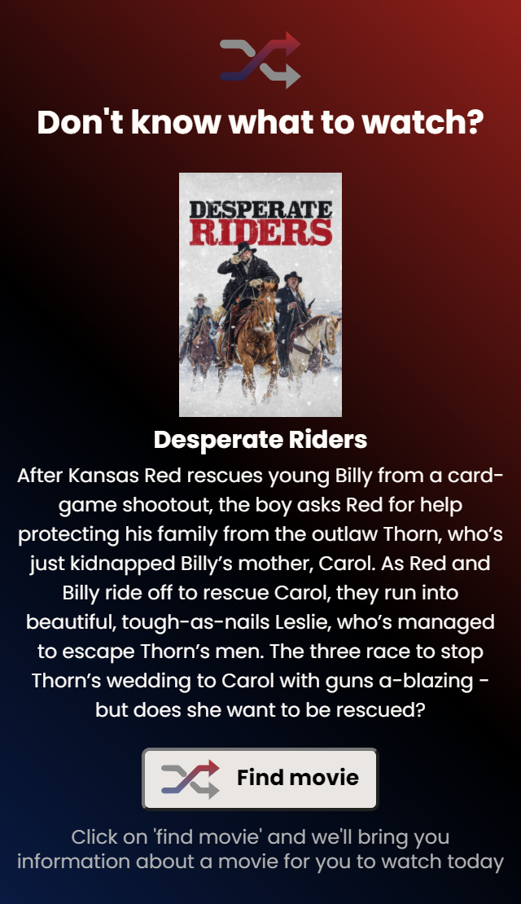

 ## Table of contents

- [Overview](#overview)
  - [The challenge](#the-challenge)
  - [Screenshot](#screenshot)
- [My process](#my-process)
  - [Built with](#built-with)
  - [Data provider](#data-provider)
  - [What I learned](#what-i-learned)
  
## Overview

### The challenge

Users should be able to:

- Click on the button and receive a recomendation of movie to watch with its respective:
    - poster
    - title
    - summary
- View the optimal layout for the app depending on their device's screen size

### Screenshot

## My process

### Built with

- Semantic HTML5 markup
- CSS custom properties
- Flexbox
- Responsive Web Design
- JavaScript 

### Data provider

This project was built consuming information from The Movie Database API (https://www.themoviedb.org/documentation/api)

### What I learned

Developing this project I put into practice the knowledge I already had, and I learned especially about consuming external APIs with Javascript

